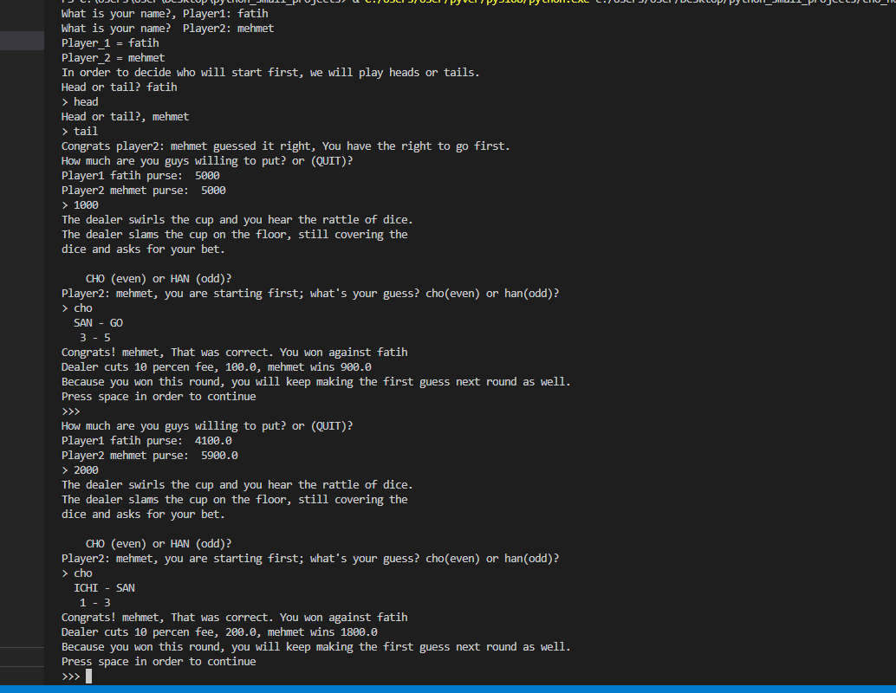

<h1 align="center">Hi 👋, I'm Fatih.</h1>
<h3 align="center">A passionate python developer from Turkey</h3>

Hey there👋 here in this repo, you can find 2 version of cho(even)-han(odd) japaneese game. 
In first version which is in cho_han.py file, you play against dealer eaither you earn or dealer earns.
In second version, you play with another person and you win or lose against each other and here dealers charge 10% of the earning whoever earns doesn't matter.

<h1 align="left">GAMEPLAY</h1>

The game uses two standard six-sided dice, which are shaken in a bamboo cup or bowl by a dealer. The cup is then overturned onto the floor. Players then place their wagers on whether the sum total of numbers showing on the two dice will be "Chō" (even) or "Han" (odd). The dealer then removes the cup, displaying the dice. The winners collect their money.

Depending on the situation, the dealer will sometimes act as the house, collecting all losing bets. More often, the players will bet against each other (this requires an equal number of players betting on odd and even) and the house will collect a set percentage of winning bets.

<h1 align="left">Game input-output</h1>

- 🌱 I’m currently learning **data structures and web development**

- 💬 Ask me about **python**

- 📫 How to reach me **sekanti02@gmail.com**

<h3 align="left">Connect with me:</h3>

<h3 align="left">Languages and Tools:</h3>

           

